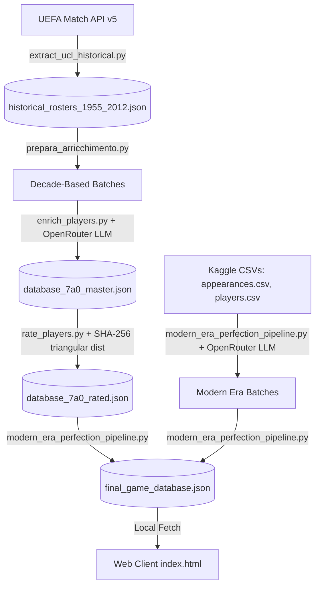

# 8-0 — Champions League Draft Game

**8-0** is an editorial-style, browser-based Champions League Football Draft Game. Build your dream XI from historical and modern UCL rosters spanning from **1955 to 2026**, test your tactical setups, and simulate a tournament run from the Group Stage all the way to the Final to hoist the cup.

---

## 🎮 Core Gameplay & Mechanics

The game operates as a single-page interactive experience with the following primary phases:

### 1. Tactical Setup
* **Formation Selection:** Choose a tactical layout that matches your footballing philosophy. Available options include `4-3-3`, `4-2-3-1`, `4-4-2`, `4-3-1-2`, `3-5-2`, `3-4-2-1`, `3-4-3`, `4-3-2-1`, and `5-4-1`.
* **Difficulty Levels:** Define how many resource tokens you start with:
  * **Easy:** 3 Reroll Tokens
  * **Normal:** 2 Reroll Tokens
  * **Hard:** 1 Reroll Token
  * **Impossible:** 0 Reroll Tokens
* **Diabolical Mode (Modalità Diabolica):** An optional toggle that disables the **Smart Roll** filter. If disabled (standard mode), the engine ensures you only draw teams containing at least one player compatible with your remaining empty positions. When enabled, any team can be drawn. If no compatible positions are found, you must force-place a player **Out-of-Position (OOP)**, which slashes their overall rating by **50%** and highlights their card border in red.

### 2. The Draft Loop
* **Roll Team:** Each roll randomly draws a specific club and UCL campaign year (e.g., *Real Madrid 1955*, *AC Milan 1989*, *Barcelona 2015*).
* **Token Management:** Spend a token to either redraw the team entirely (**Cambio Squadra**) or search for a different historical year of the same team (**Cambio Anno**). 
* **Skip Turn:** Pass on a rolled team entirely if the roster doesn't suit your needs.
* **Placement:** Select a player from the drawn roster and place them in any highlighted, compatible position on the pitch. Once a player is placed, the team-year is registered as used, and you roll again until all 11 slots are filled.

### 3. Realistic Match Simulation Engine
Once the squad is finalized, your team enters a 7-stage Champions League campaign:
* **Group Stage:** 3 matches against opponents with average ratings dynamically scaled to your own (`User - 8`, `User - 4`, and `User` ratings). You must secure at least **5 points** (or **4 points with a neutral/positive goal difference**) to qualify.
* **Knockout Stage:** Two-legged home & away ties for the **Round of 16** (`User + 2`), **Quarter-Finals** (`User + 4`), and **Semi-Finals** (`User + 6`). Aggregate scores determine who advances.
* **The Final:** A single-leg winner-take-all showdown (`User + 8`).
* **Simulation Mechanics:** 
  * Matches simulate minute-by-minute with configurable speeds (*Slow, Normal, Fast, Ultra*) and manual or automatic progression options.
  * Goal probability is dynamically calculated using a sigmoid function based on the rating delta between the two teams.
  * Scorer selection is weighted based on the player's position (e.g., ST/CF > Wingers > Midfielders > Defenders) and overall rating.
  * Tied knockout stages go to a live-simulated **Penalty Shootout**, utilizing player attributes, goalkeeper ratings, and team averages.

---

## 🛠️ Technical Architecture & Data Pipeline

The system is split into a client-side web application and an asynchronous, high-performance Python data collection pipeline.



### 1. Data Ingestion & Enrichment Scripts

* **Historical Extraction — [extract_ucl_historical.py](file:///c:/Users/lucag/8a0/extract_ucl_historical.py)**
  An asynchronous script utilizing `aiohttp` to query UEFA's API. It discover matches from 1955 to 2012 and extracts the lineups, applying round filters (such as quarter-finals and onwards for older formats).

* **Batch Preparation — [prepara_arricchimento.py](file:///c:/Users/lucag/8a0/prepara_arricchimento.py)**
  Cleans the raw historical rosters, removes duplicate entries, and splits the data into decade-based text batches to feed to the LLM.

* **LLM Enrichment — [enrich_players.py](file:///c:/Users/lucag/8a0/enrich_players.py)**
  An async pipeline that processes text batches via OpenRouter APIs (using DeepSeek reasoning models). It infers missing team designations, translates generic positions into specific modern acronyms (`GK`, `CB`, `LB`, `RB`, `CDM`, `CM`, `CAM`, `LM`, `RM`, `LW`, `RW`, `CF`, `ST`), and assigns a legendary tier (`S`, `A`, `B`, `C`, `D`) based on that specific season.

* **Modern Era Ingestion — [modern_era_perfection_pipeline.py](file:///c:/Users/lucag/8a0/modern_era_perfection_pipeline.py)**
  Extracts Champions League appearances from 2013 to 2026 using Kaggle datasets (`appearances.csv` and `players.csv`). It aggregates performance metrics (goals, assists, minutes, appearances), resolves modern tactical roles and tiers through OpenRouter, calculates ratings, and merges them with the historical data.

* **Database Normalization — [normalize_db.py](file:///c:/Users/lucag/8a0/normalize_db.py)**
  Cleans and normalizes club names to prevent duplicates (e.g., standardizing variants to canonical names like *Real Madrid*, *AC Milan*, or *Barcelona*).

### 2. Rating & Statistics Mechanics
The rating calculation is managed in [rate_players.py](file:///c:/Users/lucag/8a0/rate_players.py) (and embedded in the modern pipeline). To maintain strict consistency:
* **Deterministic Seeding:** Seed values are generated by hashing a composite key of `player_id + year` using **SHA-256**. This ensures player ratings remain constant across executions without database overhead.
* **Tier-Based Triangular Distribution:** Tiers map to specific rating boundaries:
  * **Tier S:** 94-99 (or 90-99 for modern players)
  * **Tier A:** 88-93 (or 84-89 for modern players)
  * **Tier B:** 80-87 (or 79-83 for modern players)
  * **Tier C:** 75-79 (or 73-78 for modern players)
  * **Tier D:** 65-74 (or 60-72 for modern players)
  A triangular distribution skewed to the lower bound is used to prevent stat inflation.
* **Modern Performance Adjustment:** Modern player ratings undergo a performance adjustment ranging from `[-3, +3]` based on goals, assists, total minutes, and matches played in the Champions League season.

---

## 💾 Database Schema

The web client fetches the compiled player records from [final_game_database.json](file:///c:/Users/lucag/8a0/final_game_database.json). The JSON array follows this structure:

```json
[
  {
    "player_id": "38151",
    "name": "Alfredo Di Stéfano",
    "year": 1955,
    "primary_position": "CF",
    "secondary_positions": [
      "ST",
      "CAM"
    ],
    "team_name": "Real Madrid",
    "tier": "S",
    "overall_rating": 92
  }
]
```

* **`player_id`** *(string)*: Unique identifier for the player.
* **`name`** *(string)*: Full name.
* **`year`** *(integer)*: Season final year (e.g., 2015 indicates the 2014/15 campaign).
* **`primary_position`** *(string)*: Standardized tactical acronym.
* **`secondary_positions`** *(array of strings)*: Alternate roles the player is eligible to fill.
* **`team_name`** *(string)*: Normalized club name.
* **`tier`** *(string)*: S, A, B, C, or D tier grade.
* **`overall_rating`** *(integer)*: Deterministic rating computed by the engine.

---

## 💻 Web Interface & Frontend Code

The game runs inside [index.html](file:///c:/Users/lucag/8a0/index.html) as a standalone client:
* **Modern CSS System:** Designed with a warm editorial/sports newspaper aesthetic using curated custom CSS color palettes (e.g., Paper background, Ink text, and Coral accents) and dynamic Light/Dark mode.
* **Fully Responsive:** Incorporates media queries and clamp functions for optimized display on smartphones, tablets, and desktops (ensuring pitch size scales cleanly without blocking user controls).
* **State Management:** Plain JavaScript encapsulates game states (selected formation, rolls, tokens, active player selection, tournament tracking, and simulation loop).

---

## 🚀 How to Run

### Running the Web Game
To launch the client interface locally, start a lightweight web server in the project root:

```bash
# Using Python
python -m http.server 8000
```
Open your browser and navigate to `http://localhost:8000/index.html`.

### Executing the Data Pipelines
If you need to rebuild or update the player databases, verify your OpenRouter API key inside the scripts and run:

```bash
# 1. To pull historical players
python extract_ucl_historical.py
python prepara_arricchimento.py
python enrich_players.py

# 2. To build modern players (2013-2026), calculate ratings, and compile the final DB
python modern_era_perfection_pipeline.py
```
